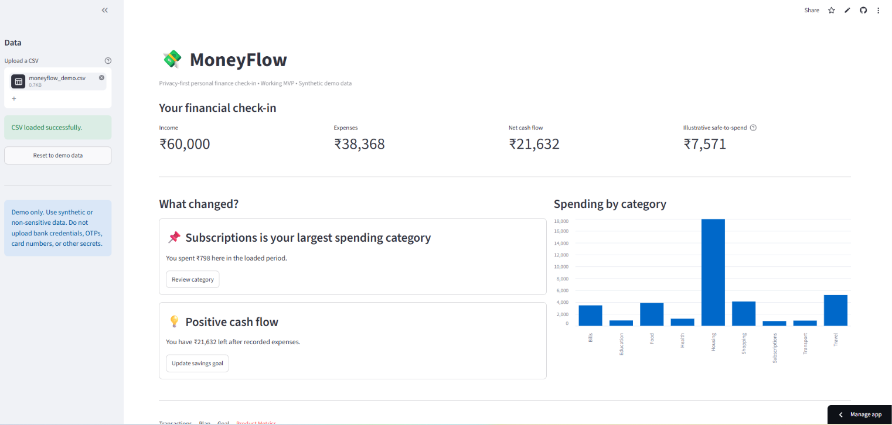
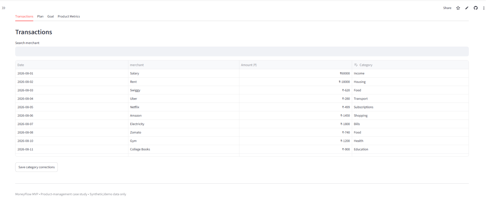
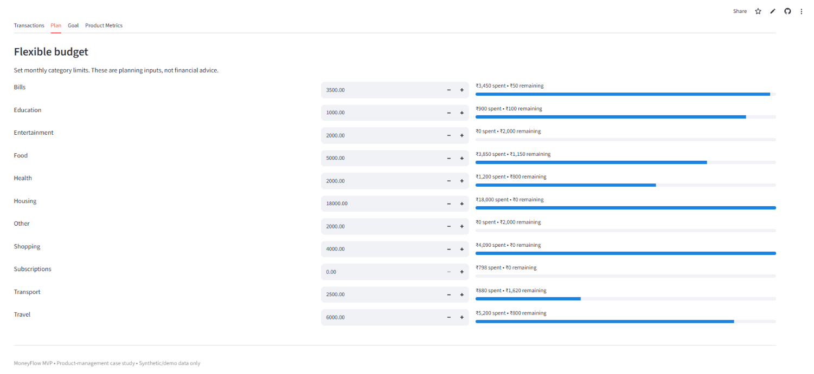
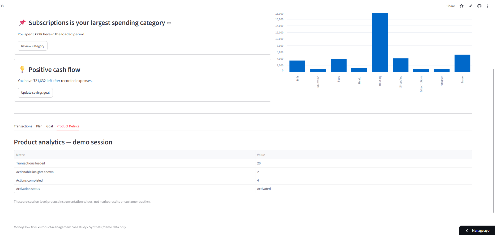
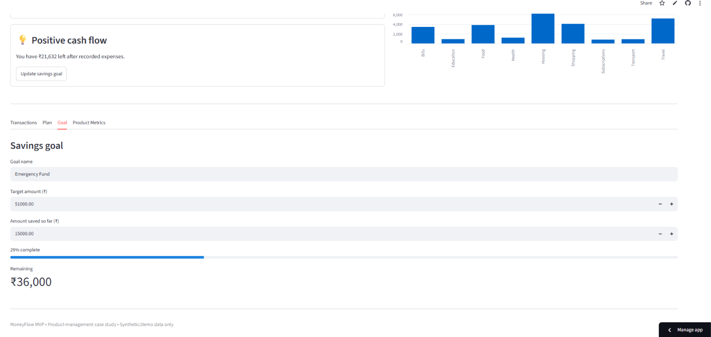

# MoneyFlow — Personal Finance Product Strategy & Launch

> **Pure Product Management Case Study | FinTech | Discovery → Strategy → MVP → PRD → Roadmap → GTM → Metrics**

**MoneyFlow** is a product-management case study for a privacy-conscious personal finance companion designed for students and early-career professionals who struggle to turn transaction data into clear, actionable financial decisions.

This repository is intentionally **PM-first**. It does not present a finance app as a finished software project. Instead, it documents how a Product Manager would identify a problem, validate it, define an MVP, prioritize the roadmap, design the experience, establish metrics, prepare a launch, and learn after release.

---

**FinTech Product Management case study + working MVP for a privacy-first personal finance decision-support product.**

[](https://moneyflow-appuct-management-abhi-iitg.streamlit.app/)
[](https://github.com/abhi-iitg/moneyflow-product-management)

> **Demo:** The MVP uses synthetic/demo financial data. Never upload bank passwords, OTPs, card numbers, account credentials, or other sensitive information.

---

## 📑 Table of Contents

- [🎯 Executive Summary](#-executive-summary)
- [🧭 PM at a Glance](#-pm-at-a-glance)
- [🎯 Product Decision in One Page](#-product-decision-in-one-page)
- [🗂️ Repository Map](#️-repository-map)
- [🔄 Product Method](#-product-method)
- [📸 MVP Screenshots](#-mvp-screenshots)
- [🧠 Evidence Discipline](#-evidence-discipline)
- [📚 Research Basis](#-research-basis)
- [⚠️ Important Disclaimer](#️-important-disclaimer)
- [💼 Portfolio Positioning](#-portfolio-positioning)
- [🚀 Working MVP](#-working-mvp)
- [👨‍💻 Author](#-author)
- [📄 License](#-license)

---

## Executive Summary

### The problem

Young adults can see transactions in banking apps, but transaction visibility does not automatically create financial control. Users commonly face three connected problems:

1. **Understanding:** "Where did my money go?"
2. **Planning:** "Can I safely spend this month?"
3. **Action:** "What should I do differently before I run out of money?"

Existing solutions often overload users with charts, categories, or generic budgeting advice. MoneyFlow proposes a simpler loop:

**See → Understand → Plan → Act → Learn**

### Target user

**Primary persona:** students and early-career professionals with irregular discretionary spending, multiple recurring payments, and limited time for manual financial planning.

### Product promise

> **MoneyFlow turns transaction history into a small number of clear, explainable actions.**

### MVP

The MVP focuses on four capabilities:

- privacy-first transaction import
- automatic spending categorization with user correction
- monthly cash-flow and spending view
- actionable budget and savings prompts

The MVP deliberately excludes investing advice, lending, payments, credit decisions, tax advice, and autonomous financial actions.

### North Star Metric

**Weekly Actionable Financial Check-ins (WAFC)**

A check-in counts when a user views their current financial status **and completes at least one meaningful action**, such as correcting a category, setting/adjusting a budget, acknowledging a recurring expense, or updating a savings goal.

This metric is chosen because MoneyFlow's value proposition is not "more dashboard views"; it is helping users understand and act.

### Target outcomes for MVP

These are **product targets, not measured results**:

- ≥ 45% of activated users complete one actionable check-in in their first 7 days
- ≥ 35% of activated users return for a second weekly check-in by week 4
- ≥ 60% of imported transactions are correctly categorized without manual correction after the first two weeks
- < 2% of imported rows fail validation
- < 1% of users report a high-severity privacy/trust issue

---

## 🧭 PM at a Glance

| Area | MoneyFlow PM Work |
|---|---|
| Problem | Turning financial data into actionable decisions |
| Target User | Digitally comfortable young professionals / students |
| Core JTBD | Understand what changed and decide what to do next |
| Product Strategy | Decision support over dashboard complexity |
| MVP | Import → Understand → Plan → Act |
| Prioritization | RICE framework + MVP trade-offs |
| UX | Action-oriented financial check-in |
| North Star Metric | Weekly Actionable Financial Check-ins |
| Experimentation | Hypothesis → Test → Metric → Guardrail → Decision |
| GTM | Targeted acquisition + activation-led onboarding |
| Trust | Privacy, transparency and user control |

---

## Product Decision in One Page

| Question | Decision |
|---|---|
| Who? | Students + early-career professionals |
| Problem? | Transaction visibility does not translate into financial action |
| Wedge? | Actionable monthly cash-flow clarity |
| MVP? | Import → categorize → understand → plan |
| Primary value metric? | Weekly Actionable Financial Check-ins |
| Business model? | Free core + optional premium planning features |
| Primary growth loop? | Personal value → recurring check-in → referral |
| Biggest risk? | Trust/privacy failure |
| Biggest product bet? | Fewer, explainable actions beat dashboard overload |
| What we will NOT do? | Investment, lending, tax, payments, autonomous money movement |

---

## Repository Map

### 🚀 Working MVP

| Resource | Purpose |
|---|---|
| [`app.py`](./app.py) | Working Streamlit MVP |
| [`requirements.txt`](./requirements.txt) | MVP dependencies |
| [`RUN_MVP.md`](./RUN_MVP.md) | Setup, testing and validation procedure |
| [`DEMO_SCRIPT.md`](./DEMO_SCRIPT.md) | Recruiter-facing MVP demo walkthrough |
| [`ARCHITECTURE.md`](./ARCHITECTURE.md) | MVP architecture and implementation overview |

---

### 🧭 Product Management Lifecycle

| Stage | PM Artifacts |
|---|---|
| **01 — Discovery** | [Problem Statement](./01-discovery/problem-statement.md) · [User Research Plan](./01-discovery/user-research-plan.md) · [Personas](./01-discovery/personas.md) · [JTBD](./01-discovery/JTBD.md) · [Customer Journey](./01-discovery/customer-journey.md) · [Opportunity Solution Tree](./01-discovery/opportunity-solution-tree.md) |
| **02 — Market** | [Competitive Analysis](./02-market/competitive-analysis.md) · [Market Sizing](./02-market/market-sizing.md) · [Positioning](./02-market/positioning.md) |
| **03 — Strategy** | [Product Vision](./03-strategy/product-vision.md) · [Product Strategy](./03-strategy/product-strategy.md) · [Business Model](./03-strategy/business-model.md) · [Product Principles](./03-strategy/product-principles.md) |
| **04 — Prioritization** | [Feature Backlog](./04-prioritization/feature-backlog.md) · [RICE Prioritization](./04-prioritization/RICE-prioritization.md) · [MVP Scope](./04-prioritization/MVP-scope.md) |
| **05 — PRD** | [PRD](./05-prd/PRD.md) · [User Stories](./05-prd/user-stories.md) · [Acceptance Criteria](./05-prd/acceptance-criteria.md) · [Non-Functional Requirements](./05-prd/non-functional-requirements.md) |
| **06 — UX** | [Information Architecture](./06-ux/information-architecture.md) · [User Flows](./06-ux/user-flows.md) · [Wireframe Specification](./06-ux/wireframe-spec.md) |
| **07 — Roadmap** | [Product Roadmap](./07-roadmap/product-roadmap.md) · [Release Plan](./07-roadmap/release-plan.md) |
| **08 — Metrics** | [North Star Metric](./08-metrics/north-star-metric.md) · [Metrics Tree](./08-metrics/metrics-tree.md) · [Funnel](./08-metrics/funnel.md) · [KPI Dictionary](./08-metrics/KPI-dictionary.md) |
| **09 — Launch** | [GTM Strategy](./09-launch/GTM-strategy.md) · [Launch Plan](./09-launch/launch-plan.md) · [Stakeholder Plan](./09-launch/stakeholder-plan.md) |
| **10 — Experimentation** | [Experiment Backlog](./10-experimentation/experiment-backlog.md) · [Onboarding Experiment](./10-experimentation/experiment-01-onboarding.md) |
| **11 — Risk** | [Risk Register](./11-risk/risk-register.md) · [Privacy & Trust](./11-risk/privacy-trust.md) · [Assumptions](./11-risk/assumptions.md) |
| **12 — Post-Launch** | [30/60/90-Day Plan](./12-post-launch/30-60-90-day-plan.md) · [Iteration Framework](./12-post-launch/iteration-framework.md) |

---

### 📸 Product Evidence & Supporting Material

| Resource | Purpose |
|---|---|
| [`docs/screenshots/`](./docs/screenshots/) | Working MVP screenshots |
| [`portfolio/`](./portfolio/) | Portfolio-ready case study material |
| [`SOURCES.md`](./SOURCES.md) | Research and reference basis |
| [`.github/`](./.github/) | GitHub repository configuration |

---

### 📄 Repository-Level Files

| File | Purpose |
|---|---|
| [`README.md`](./README.md) | Main product case study and project overview |
| [`LICENSE`](./LICENSE) | MIT License |
| [`.gitignore`](./.gitignore) | Git ignore configuration |
---

### 📁 Repository Structure

```text
moneyflow-product-management/
│
├── 📄 README.md
├── 📄 LICENSE
├── 📄 .gitignore
│
├── 🚀 Working MVP
│   ├── app.py
│   ├── requirements.txt
│   ├── RUN_MVP.md
│   ├── DEMO_SCRIPT.md
│   └── ARCHITECTURE.md
│
├── 🧭 Product Management
│   ├── 01-discovery/
│   ├── 02-market/
│   ├── 03-strategy/
│   ├── 04-prioritization/
│   ├── 05-prd/
│   ├── 06-ux/
│   ├── 07-roadmap/
│   ├── 08-metrics/
│   ├── 09-launch/
│   ├── 10-experimentation/
│   ├── 11-risk/
│   └── 12-post-launch/
│
├── 📸 Product Evidence
│   └── docs/
│       └── screenshots/
│
├── 💼 Portfolio
│   └── portfolio/
│
├── 📚 Research
│   └── SOURCES.md
│
└── ⚙️ GitHub
    └── .github/

---

## Product Method

MoneyFlow follows a repeatable PM operating loop:

**Discover**
→ identify the highest-value user problem

**Define**
→ establish target user, JTBD, opportunity and constraints

**Strategize**
→ choose a differentiated wedge and business model

**Prioritize**
→ compare opportunities using RICE + strategic fit

**Specify**
→ write the PRD, stories and acceptance criteria

**Design**
→ map information architecture and critical user flows

**Plan**
→ sequence releases around outcomes, not feature volume

**Launch**
→ coordinate GTM, instrumentation, support and risk controls

**Learn**
→ evaluate metrics and experiments, then iterate

---

## 📸 MVP Screenshots

### MoneyFlow — Financial Check-in Dashboard



### 2. Transaction Management



### 3. Budget Planning



### 4. Product Metrics



### 5. Goals



### What the MVP demonstrates

- 💰 Income and expense overview
- 📈 Net cash-flow visibility
- 🔎 "What changed?" actionable insights
- 📊 Spending-by-category analysis
- 📁 CSV transaction upload
- ✏️ Transaction categorization and correction
- 🎯 Budget and savings-goal planning
- 🔐 Privacy-first data handling

---

## 👨‍💼 My PM Contribution

This project was approached as a **Product Management problem**, not simply as a software-development exercise.

I worked through:

- Problem framing
- User/persona definition
- Jobs-to-be-Done
- Customer journey
- Competitive analysis
- Product positioning
- Product strategy
- Feature prioritization using RICE
- MVP definition
- PRD and user stories
- UX flows
- Product metrics
- Experiment design
- GTM strategy
- Risk and privacy considerations
- Working MVP execution

---

## ⚡ Recruiter 60-Second View

**Problem:** Users can see financial transactions but often struggle to convert them into decisions.

**Insight:** The product opportunity is not another dashboard; it is an actionable financial decision-support loop.

**Solution:** MoneyFlow converts transaction data into understandable insights, planning actions and measurable follow-through.

**MVP:** CSV import → categorization → cash-flow analysis → actionable insight → budget/goal planning.

**PM Methods:** JTBD, personas, competitive analysis, RICE, PRD, UX flows, metrics, experimentation and GTM.

**Validation Approach:** Build the smallest testable product around the core decision-support loop before investing in bank integrations or advanced financial features.

**Live:** [Open MoneyFlow MVP →](https://moneyflow-appuct-management-abhi-iitg.streamlit.app/)

---

## Key Product Decisions

### Why CSV instead of direct bank integration?

**Decision:** Start with CSV import.

**Why:**

- Faster MVP validation
- Lower integration and compliance complexity
- Greater user control over financial data
- Allows validation of the core product value before building expensive integrations

### Why rule-based categorization?

**Decision:** Use transparent rules in the MVP.

**Why:**

- Explainable
- Deterministic
- Easy to debug
- Appropriate for an early-stage prototype

### Why not build investment or lending features?

These capabilities were deliberately excluded because they introduce significantly greater financial, trust and compliance risks without being necessary to validate the initial product thesis.

---

## Evidence Discipline

This case study separates:

- **Evidence:** findings supported by cited research or clearly stated assumptions
- **Hypothesis:** a belief to validate
- **Target:** an intended future outcome
- **Decision:** a deliberate product choice
- **Result:** a measured outcome after launch

No fictional survey result, customer quote, revenue number, conversion result, or A/B-test outcome is presented as if it actually happened.

---

## Research Basis

The product structure was informed by public GitHub PM/FinTech references including:

- personal-finance PRD patterns
- FinTech product analytics and lifecycle analysis
- SMB financial workflow products
- FinTech competitive/product case studies
- PM frameworks for PRDs, MVPs, prioritization and roadmaps

The repository is an **original case study**. No source repository is copied, forked, or represented as MoneyFlow.

---

## Important Disclaimer

MoneyFlow is a product-management case study and not a regulated financial service. It does not provide investment, tax, legal, lending, credit, accounting, or financial advice. Any financial examples are illustrative.

---

## Portfolio Positioning

**Resume project title:**

> **MoneyFlow — Personal Finance Product Strategy & Launch**

**One-line description:**

> Designed a privacy-first personal finance product from discovery to launch, defining the MVP, PRD, RICE roadmap, UX flows, KPI tree, GTM strategy and experimentation plan for students and early-career professionals.

---


## Working MVP

This repository now includes a runnable Streamlit prototype that demonstrates the core product loop:

**Import → Validate → Categorize → Understand → Plan → Act → Measure**

### Run locally

```bash
pip install -r requirements.txt
streamlit run app.py
```

See **[RUN_MVP.md](RUN_MVP.md)** for the complete test procedure and **[DEMO_SCRIPT.md](DEMO_SCRIPT.md)** for a recruiter demo walkthrough.

The prototype uses synthetic data, transparent rule-based categorization, session state, CSV import, category correction, budgets, savings goals, actionable insights and session-level product instrumentation.

---

## Author

**Abhishek Kumar Gond**  
IIT Guwahati | Product Management / Data & AI
- **Email : mr.abhishekaaa@gmail.com**
- **[Portfolio]()**
- **[LinkedIn](https://www.linkedin.com/in/abhishekkumargond/)**

---

## License

Released under the [MIT License](LICENSE).

---
