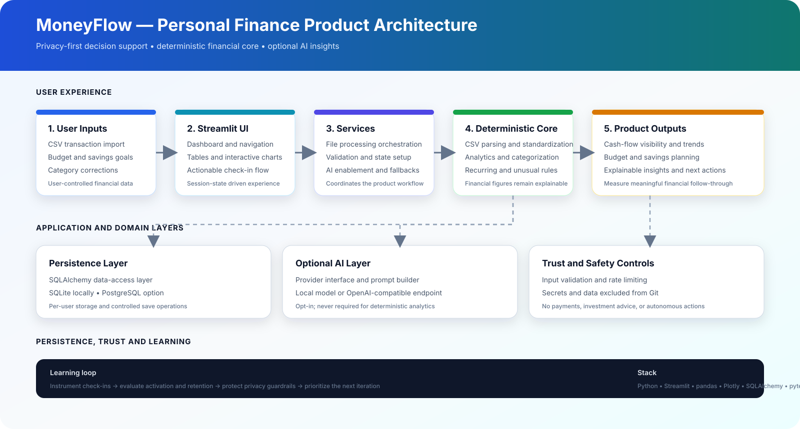

# MoneyFlow — Personal Finance Product Strategy & Launch

> **FinTech Product Management Case Study | Discovery → Strategy → MVP → PRD → Roadmap → GTM → Metrics**

<p align="center">
  <strong>MoneyFlow is a privacy-first personal finance decision-support product for students and early-career professionals.</strong><br/>
  It turns transaction history into clear, explainable financial actions.
</p>

<p align="center">
  <a href="https://moneyflow-appuct-management-abhi-iitg.streamlit.app/"></a>
  <a href="https://github.com/abhi-iitg/moneyflow-product-management"></a>
  <a href="https://abhishek-kg-portfolio.vercel.app/"></a>
  <a href="https://www.linkedin.com/in/abhishekkumargond/"></a>
  <a href="mailto:mr.abhishekaa@gmail.com"></a>
</p>

> **Demo-data notice:** The MVP uses synthetic/demo financial data. Never upload bank passwords, OTPs, card numbers, account credentials, or other sensitive information.

---

## Table of Contents

- [Project Overview](#project-overview)
- [Executive Summary](#executive-summary)
- [Problem Statement](#problem-statement)
- [Target Users](#target-users)
- [Product Thesis](#product-thesis)
- [Product Decision in One Page](#product-decision-in-one-page)
- [MVP Scope](#mvp-scope)
- [Product Workflow](#product-workflow)
- [Architecture Overview](#architecture-overview)
- [PM at a Glance](#pm-at-a-glance)
- [Product Management Lifecycle](#product-management-lifecycle)
- [Key Product Decisions](#key-product-decisions)
- [Metrics and Experimentation](#metrics-and-experimentation)
- [MVP Screenshots](#mvp-screenshots)
- [Repository Map](#repository-map)
- [Technology Stack](#technology-stack)
- [Run the MVP Locally](#run-the-mvp-locally)
- [Validation and QA](#validation-and-qa)
- [Evidence Discipline](#evidence-discipline)
- [Privacy, Trust and Scope Boundaries](#privacy-trust-and-scope-boundaries)
- [Roadmap](#roadmap)
- [Recruiter 60-Second View](#recruiter-60-second-view)
- [Portfolio Positioning](#portfolio-positioning)
- [Author](#author)
- [License](#license)

---

## Project Overview

**MoneyFlow** is a product-management case study supported by a working Streamlit MVP. The project documents how a Product Manager can take a financial problem from discovery to launch while balancing user value, trust, privacy, compliance risk, and measurable outcomes.

The repository is intentionally **PM-first**. It demonstrates a complete product operating process:

**Problem discovery → user research → strategy → prioritization → PRD → UX → roadmap → GTM → experimentation → launch learning**

### Product promise

> **MoneyFlow turns transaction history into a small number of clear, explainable actions.**

### Product philosophy

**See → Understand → Plan → Act → Learn**

---

## Executive Summary

### The opportunity

Banking applications make transactions visible, but visibility alone does not always create financial control. Users may still struggle to understand spending patterns, plan for the rest of the month, and decide what action to take next.

MoneyFlow focuses on the decision-support gap between **having financial data** and **using it confidently**.

### The proposed solution

A privacy-conscious personal finance companion that helps users:

1. Import transaction data.
2. Understand income, expenses, and cash flow.
3. Correct or improve transaction categorization.
4. Identify recurring and unusual spending.
5. Set budgets and savings goals.
6. Complete a short, actionable financial check-in.

### MVP North Star Metric

**Weekly Actionable Financial Check-ins (WAFC)**

A check-in counts when a user views their current financial status **and completes at least one meaningful action**, such as correcting a category, adjusting a budget, acknowledging a recurring expense, or updating a savings goal.

### Proposed MVP targets

These are **product targets, not measured results**:

- ≥ 45% of activated users complete one actionable check-in in their first 7 days.
- ≥ 35% of activated users return for a second weekly check-in by week 4.
- ≥ 60% of imported transactions are correctly categorized without manual correction after the first two weeks.
- < 2% of imported rows fail validation.
- < 1% of users report a high-severity privacy or trust issue.

---

## Problem Statement

Young adults commonly face three connected questions:

| User question | Product need |
|---|---|
| **“Where did my money go?”** | Understand spending and cash-flow patterns |
| **“Can I safely spend this month?”** | Plan around recurring expenses and available cash |
| **“What should I do differently?”** | Receive clear, explainable next actions |

Existing finance tools can overwhelm users with charts, categories, and generic advice. MoneyFlow therefore prioritizes **actionable clarity over dashboard complexity**.

---

## Target Users

### Primary persona

Students and early-career professionals who are digitally comfortable but have:

- Irregular discretionary spending.
- Multiple recurring payments.
- Limited time for manual financial planning.
- A need for simple, trustworthy financial visibility.
- Low tolerance for complicated setup or opaque recommendations.

### Core job-to-be-done

> **When I review my finances, I want to understand what changed and decide what to do next, so that I can stay in control without spending significant time maintaining a budget.**

---

## Product Thesis

### Hypothesis

If users receive a concise, explainable financial check-in instead of a complex dashboard, they will be more likely to understand their current position and complete a useful financial action.

### Strategic wedge

**Actionable monthly cash-flow clarity**

MoneyFlow is not trying to replace banking, investing, lending, or accounting platforms. Its initial wedge is the recurring decision moment between receiving transaction data and deciding how to spend, save, or adjust a budget.

---

## Product Decision in One Page

| Question | Decision |
|---|---|
| **Who?** | Students and early-career professionals |
| **Problem?** | Transaction visibility does not automatically translate into financial action |
| **Wedge?** | Actionable monthly cash-flow clarity |
| **MVP?** | Import → categorize → understand → plan |
| **Primary value metric?** | Weekly Actionable Financial Check-ins |
| **Business model?** | Free core with optional premium planning features |
| **Primary growth loop?** | Personal value → recurring check-in → referral |
| **Biggest risk?** | Trust or privacy failure |
| **Biggest product bet?** | Fewer, explainable actions beat dashboard overload |
| **Explicitly out of scope** | Investment, lending, tax, payments, and autonomous money movement |

---

## MVP Scope

### Included in the MVP

- Privacy-first CSV transaction import.
- Automatic spending categorization with user correction.
- Income, expense, and net cash-flow overview.
- Category-level spending analysis.
- Recurring-payment and subscription detection.
- Unusual-transaction detection using configurable rules.
- Budget recommendations using transparent heuristics.
- Budget planning and savings-goal tabs.
- Actionable financial insights.
- Session-level product instrumentation.

### Deliberately excluded

The MVP does **not** provide investment recommendations, lending or credit decisions, tax or legal advice, payment execution, autonomous money movement, direct bank-account integration, or regulated financial services.

---

## Product Workflow

```text
Import → Validate → Categorize → Understand → Plan → Act → Measure → Learn
```

1. Upload a supported CSV statement.
2. Validate and standardize transaction rows.
3. Review automatically assigned categories.
4. Correct categories where necessary.
5. Inspect income, expenses, net cash flow, recurring payments, and unusual activity.
6. Set or adjust a budget and savings goal.
7. Complete an actionable check-in.
8. Use product metrics and feedback to improve the experience.

---

## Architecture Overview

The architecture separates the deterministic financial core from optional AI functionality. Financial figures are computed by deterministic application logic; AI is an opt-in presentation layer that formats already-computed information into natural-language insights.



### Architecture principles

- **Local-first:** parsing and analytics run locally by default.
- **Deterministic core:** financial calculations do not depend on an AI model.
- **Optional AI:** AI insights are disabled by default and isolated behind a provider interface.
- **Clear separation of concerns:** UI, services, domain logic, and persistence are separated.
- **User control:** users can review, correct, save, or discard imported data.
- **Privacy by design:** secrets, databases, uploads, logs, and model files are excluded from version control.

```text
Streamlit UI
    ↓
Application Services
    ↓
Domain Logic
    ├── CSV Parsing and Standardization
    ├── Financial Analytics
    ├── Categorization
    ├── Subscription Detection
    ├── Unusual-Transaction Rules
    └── Authentication and Validation
    ↓
Persistence
    └── SQLAlchemy → SQLite / PostgreSQL

Optional AI Layer
    └── Provider Interface → Local or OpenAI-compatible Endpoint
```

---

## PM at a Glance

| Area | MoneyFlow PM Work |
|---|---|
| Problem | Turning financial data into actionable decisions |
| Target user | Digitally comfortable students and young professionals |
| Core JTBD | Understand what changed and decide what to do next |
| Product strategy | Decision support over dashboard complexity |
| MVP | Import → Understand → Plan → Act |
| Prioritization | RICE framework and explicit MVP trade-offs |
| UX | Action-oriented financial check-in |
| North Star Metric | Weekly Actionable Financial Check-ins |
| Experimentation | Hypothesis → Test → Metric → Guardrail → Decision |
| GTM | Targeted acquisition and activation-led onboarding |
| Trust | Privacy, transparency, and user control |

---

## Product Management Lifecycle

| Stage | PM artifacts |
|---|---|
| **01 — Discovery** | [Problem Statement](./01-discovery/problem-statement.md) · [User Research Plan](./01-discovery/user-research-plan.md) · [Personas](./01-discovery/personas.md) · [JTBD](./01-discovery/JTBD.md) · [Customer Journey](./01-discovery/customer-journey.md) · [Opportunity Solution Tree](./01-discovery/opportunity-solution-tree.md) |
| **02 — Market** | [Competitive Analysis](./02-market/competitive-analysis.md) · [Market Sizing](./02-market/market-sizing.md) · [Positioning](./02-market/positioning.md) |
| **03 — Strategy** | [Product Vision](./03-strategy/product-vision.md) · [Product Strategy](./03-strategy/product-strategy.md) · [Business Model](./03-strategy/business-model.md) · [Product Principles](./03-strategy/product-principles.md) |
| **04 — Prioritization** | [Feature Backlog](./04-prioritization/feature-backlog.md) · [RICE Prioritization](./04-prioritization/RICE-prioritization.md) · [MVP Scope](./04-prioritization/MVP-scope.md) |
| **05 — PRD** | [PRD](./05-prd/PRD.md) · [User Stories](./05-prd/user-stories.md) · [Acceptance Criteria](./05-prd/acceptance-criteria.md) · [Non-Functional Requirements](./05-prd/non-functional-requirements.md) |
| **06 — UX** | [Information Architecture](./06-ux/information-architecture.md) · [User Flows](./06-ux/user-flows.md) · [Wireframe Specification](./06-ux/wireframe-spec.md) |
| **07 — Roadmap** | [Product Roadmap](./07-roadmap/product-roadmap.md) · [Release Plan](./07-roadmap/release-plan.md) |
| **08 — Metrics** | [North Star Metric](./08-metrics/north-star-metric.md) · [Metrics Tree](./08-metrics/metrics-tree.md) · [Funnel](./08-metrics/funnel.md) · [KPI Dictionary](./08-metrics/KPI-dictionary.md) |
| **09 — Launch** | [GTM Strategy](./09-launch/GTM-strategy.md) · [Launch Plan](./09-launch/launch-plan.md) · [Stakeholder Plan](./09-launch/stakeholder-plan.md) |
| **10 — Experimentation** | [Experiment Backlog](./10-experimentation/experiment-backlog.md) · [Onboarding Experiment](./10-experimentation/experiment-01-onboarding.md) |
| **11 — Risk** | [Risk Register](./11-risk/risk-register.md) · [Privacy & Trust](./11-risk/privacy-trust.md) · [Assumptions](./11-risk/assumptions.md) |
| **12 — Post-Launch** | [30/60/90-Day Plan](./12-post-launch/30-60-90-day-plan.md) · [Iteration Framework](./12-post-launch/iteration-framework.md) |

---

## Key Product Decisions

### Why CSV instead of direct bank integration?

**Decision:** Start with CSV import.

**Rationale:** Faster MVP validation, lower integration and compliance complexity, greater user control, and the ability to validate the core value proposition before building expensive integrations.

### Why rule-based categorization?

**Decision:** Use transparent rules in the MVP.

**Rationale:** Explainable, deterministic, easy to debug, and appropriate for an early-stage prototype.

### Why isolate AI?

AI can turn computed figures into readable explanations, but it should not become the source of truth for financial calculations. The deterministic core remains fully usable without an AI provider.

### Why exclude investment and lending features?

These capabilities introduce substantially greater financial, trust, and compliance risks without being necessary to validate the initial product thesis.

---

## Metrics and Experimentation

### North Star Metric

**Weekly Actionable Financial Check-ins (WAFC)**

### Supporting metrics

- Activation rate.
- First-week check-in completion.
- Week-four return rate.
- Category-correction rate.
- Budget creation and adjustment rate.
- Savings-goal creation rate.
- CSV validation failure rate.
- AI insight usage and fallback rate.
- Privacy or trust issue rate.

### Guardrails

- No high-severity privacy incidents.
- No unexplained financial calculations.
- No unsupported financial advice.
- No increase in false confidence caused by AI-generated text.
- No material degradation in import reliability.

### Experiment framework

```text
Hypothesis → Experiment design → Primary metric → Guardrail metric → Decision rule → Ship, iterate, or stop
```

---

## MVP Screenshots

### Financial Check-in Dashboard


### Transaction Management


### Budget Planning


### Product Metrics


### Savings Goals


### What the MVP demonstrates

- Income and expense overview.
- Net cash-flow visibility.
- “What changed?” actionable insights.
- Spending-by-category analysis.
- CSV transaction upload.
- Transaction categorization and correction.
- Budget and savings-goal planning.
- Privacy-first data handling.

---

## Repository Map

| Resource | Purpose |
|---|---|
| [`app.py`](./app.py) | Working Streamlit MVP |
| [`requirements.txt`](./requirements.txt) | MVP dependencies |
| [`RUN_MVP.md`](./RUN_MVP.md) | Setup, testing, and validation procedure |
| [`DEMO_SCRIPT.md`](./DEMO_SCRIPT.md) | Recruiter-facing MVP demo walkthrough |
| [`ARCHITECTURE.md`](./ARCHITECTURE.md) | MVP architecture and implementation overview |
| [`docs/screenshots/`](./docs/screenshots/) | Working MVP screenshots |
| [`docs/architecture/`](./docs/architecture/) | Architecture diagrams |
| [`portfolio/`](./portfolio/) | Portfolio-ready case-study material |
| [`SOURCES.md`](./SOURCES.md) | Research and reference basis |
| [`.github/`](./.github/) | GitHub repository configuration |

```text
moneyflow-product-management/
├── README.md
├── LICENSE
├── .gitignore
├── app.py
├── requirements.txt
├── RUN_MVP.md
├── DEMO_SCRIPT.md
├── ARCHITECTURE.md
├── 01-discovery/
├── 02-market/
├── 03-strategy/
├── 04-prioritization/
├── 05-prd/
├── 06-ux/
├── 07-roadmap/
├── 08-metrics/
├── 09-launch/
├── 10-experimentation/
├── 11-risk/
├── 12-post-launch/
├── docs/
│   ├── architecture/
│   │   └── moneyflow-architecture.svg
│   └── screenshots/
├── portfolio/
├── SOURCES.md
└── .github/
```

---

## Technology Stack

| Layer | Technology |
|---|---|
| Interface | Streamlit |
| Language | Python |
| Data processing | pandas / NumPy |
| Visualization | Plotly |
| Persistence | SQLAlchemy |
| Local database | SQLite |
| Production database option | PostgreSQL |
| Optional AI integration | Local model or OpenAI-compatible endpoint |
| Testing | pytest |
| Deployment | Streamlit Community Cloud |

---

## Run the MVP Locally

```bash
git clone https://github.com/abhi-iitg/moneyflow-product-management.git
cd moneyflow-product-management
python -m venv .venv
```

**Windows**

```bash
.venv\Scripts\activate
```

**macOS / Linux**

```bash
source .venv/bin/activate
```

Install and run:

```bash
pip install -r requirements.txt
streamlit run app.py
```

Then open the local Streamlit URL shown in the terminal. See [`RUN_MVP.md`](./RUN_MVP.md) for the complete procedure and [`DEMO_SCRIPT.md`](./DEMO_SCRIPT.md) for a recruiter-facing walkthrough.

---

## Validation and QA

Recommended checks before presenting the project:

```bash
python -m compileall .
pytest
```

### QA checklist

- CSV upload works with supported column formats.
- Invalid or malformed rows are handled safely.
- Category corrections update downstream summaries.
- Income, expense, and net cash-flow values remain consistent.
- Budget and savings-goal changes persist during the session.
- Optional AI failure does not break the deterministic core.
- No secrets or real financial data are committed.
- Screenshots contain only synthetic/demo information.
- README links resolve correctly on GitHub.

---

## Evidence Discipline

This case study separates:

- **Evidence:** findings supported by cited research or clearly stated assumptions.
- **Hypothesis:** a belief that still requires validation.
- **Target:** an intended future outcome.
- **Decision:** a deliberate product choice.
- **Result:** a measured outcome after launch.

No fictional survey result, customer quote, revenue number, conversion result, or A/B-test outcome is presented as if it actually happened.

The repository is an **original case study** and should not be represented as a copied or forked project.

---

## Privacy, Trust and Scope Boundaries

MoneyFlow is designed as a privacy-conscious educational prototype:

- Financial calculations are deterministic.
- AI insights are optional and disabled by default.
- Local-first execution is supported.
- Remote AI providers may receive summarized financial figures when explicitly enabled.
- Secrets belong only in a local `.env` file and must never be committed.
- Databases, uploads, logs, and model files are excluded from version control.
- The product does not execute payments or move money.

### Important disclaimer

MoneyFlow is a product-management case study and educational prototype—not a regulated financial service. It does not provide investment, tax, legal, lending, credit, accounting, or financial advice. Financial examples are illustrative and should be independently verified.

---

## Roadmap

- Transaction de-duplication on save.
- Analysis-history interface.
- Additional import formats such as Excel, OFX, and PDF.
- Expanded screenshot and demo coverage.
- More robust bank-data integrations.
- Improved anomaly detection.
- Personalized financial planning.
- Stronger experimentation instrumentation.
- Accessibility and usability improvements.
- Production-grade security and compliance review.

---

## Recruiter 60-Second View

**Problem:** Users can see financial transactions but often struggle to convert them into decisions.

**Insight:** The opportunity is not another dashboard; it is an actionable financial decision-support loop.

**Solution:** MoneyFlow converts transaction data into understandable insights, planning actions, and measurable follow-through.

**MVP:** CSV import → categorization → cash-flow analysis → actionable insight → budget/goal planning.

**PM methods:** JTBD, personas, competitive analysis, RICE, PRD, UX flows, metrics, experimentation, GTM, and risk management.

**Validation approach:** Build the smallest testable product around the core decision-support loop before investing in bank integrations or advanced financial features.

**Live demo:** [Open MoneyFlow MVP](https://moneyflow-appuct-management-abhi-iitg.streamlit.app/)

---

## Portfolio Positioning

### Resume project title

> **MoneyFlow — Personal Finance Product Strategy & Launch**

### Resume-ready description

> Designed a privacy-first personal finance product from discovery to launch, defining the MVP, PRD, RICE roadmap, UX flows, KPI tree, GTM strategy, experimentation plan, and working Streamlit prototype for students and early-career professionals.

### Skills demonstrated

- Product discovery and problem framing.
- User personas and Jobs-to-be-Done.
- Competitive analysis and positioning.
- Product strategy and MVP scoping.
- RICE prioritization.
- PRD and acceptance criteria.
- UX flows and information architecture.
- Product analytics and KPI design.
- Experimentation and launch planning.
- Risk, privacy, and trust thinking.
- Cross-functional communication through a working prototype.

---

## Author

**Abhishek Kumar Gond**  
IIT Guwahati 

- **Portfolio:** [abhishek-kg-portfolio.vercel.app](https://abhishek-kg-portfolio.vercel.app/)
- **LinkedIn:** [abhishekkumargond](https://www.linkedin.com/in/abhishekkumargond/)
- **Email:** [mr.abhishekaa@gmail.com](mailto:mr.abhishekaa@gmail.com)

---

## License

Released under the [MIT License](./LICENSE).
